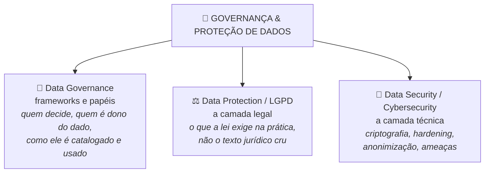

# 🌂 Governança & Proteção de Dados — Caderno Temático (NotebookLM)

> Projeto do desafio **"IA como Ferramenta de Aprendizagem Ativa"** — curso Dados, IA & Cyber (DIO).
> Guia prático de data security construído a partir de um caderno no NotebookLM.

---

## 🎯 Contexto e Objetivos

Este caderno organiza o estudo de **Governança & Proteção de Dados** como um guarda-chuva com três camadas complementares — uma de gestão, uma legal e uma técnica:

> 💡 Esse diagrama é renderizado automaticamente pelo GitHub (não precisa de imagem externa). Se quiser uma versão mais elaborada depois, dá pra gerar como imagem separada e trocar por um ``.

**Objetivo do caderno:** sair com um guia de consulta prática — não um resumo acadêmico de cada framework isolado — que sirva de referência real no dia a dia de um profissional de BI/Analytics que lida com dados sensíveis de clientes (ex: setor fintech).

---

## 📚 Fontes por tópico

### 📘 Data Governance (frameworks e papéis)

| Fonte | Link |
|---|---|
| DGI Data Governance Framework | https://datagovernance.com/the-dgi-data-governance-framework/ |
| Os 10 componentes do DGI Framework | https://datagovernance.com/the-dgi-data-governance-framework/dgi-data-governance-framework-components/ |
| NIST Cybersecurity Framework 2.0 — função Govern (papéis e responsabilidades de governança) | https://nvlpubs.nist.gov/nistpubs/CSWP/NIST.CSWP.29.pdf |

### ⚖️ Data Protection / LGPD (a camada legal, aplicada)

| Fonte | Link |
|---|---|
| Lei nº 13.709/2018 — LGPD (texto integral) | https://www.planalto.gov.br/ccivil_03/_ato2015-2018/2018/lei/l13709.htm |
| Guia de Boas Práticas para Implementação da LGPD (ANPD) | https://www.gov.br/governodigital/pt-br/privacidade-e-seguranca/guias/guia_lgpd.pdf |

### 🔐 Data Security / Cybersecurity (a camada técnica)

| Fonte | Link |
|---|---|
| OWASP Database Security Cheat Sheet (hardening de banco de dados) | https://cheatsheetseries.owasp.org/cheatsheets/Database_Security_Cheat_Sheet.html |
| OWASP Cryptographic Storage Cheat Sheet (criptografia na prática) | https://cheatsheetseries.owasp.org/cheatsheets/Cryptographic_Storage_Cheat_Sheet.html |
| ENISA Threat Landscape (panorama de ameaças reais) | https://www.enisa.europa.eu/publications |
| Google Hacking Database — GHDB (Exploit-DB/OffSec) — como buscas expõem bancos de dados | https://www.exploit-db.com/google-hacking-database |
| Microsoft Presidio — framework open source (Python) para detectar e anonimizar PII | https://microsoft.github.io/presidio/ |
| Presidio aplicado a dados estruturados (DataFrames) | https://microsoft.github.io/presidio/structured/ |
| Presidio + Faker para anonimizar dados antes de enviar a um LLM | https://python.langchain.com/docs/guides/privacy/presidio_data_anonymization |
| Presidio + PySpark no Microsoft Fabric (Lakehouse/pipelines de dados) | https://blog.fabric.microsoft.com/en-au/blog/privacy-by-design-pii-detection-and-anonymization-with-pyspark-on-microsoft-fabric |

---

## 🚧 Próximos passos

- [ ] Subir todas as fontes acima no caderno do NotebookLM
- [ ] Rodar prompts estratégicos por camada (governança / LGPD prática / segurança técnica)
- [ ] Documentar perguntas, respostas e dificuldades (engenharia de prompt)
- [ ] Consolidar o miniguia final: resumos, glossário e prompts reutilizáveis
